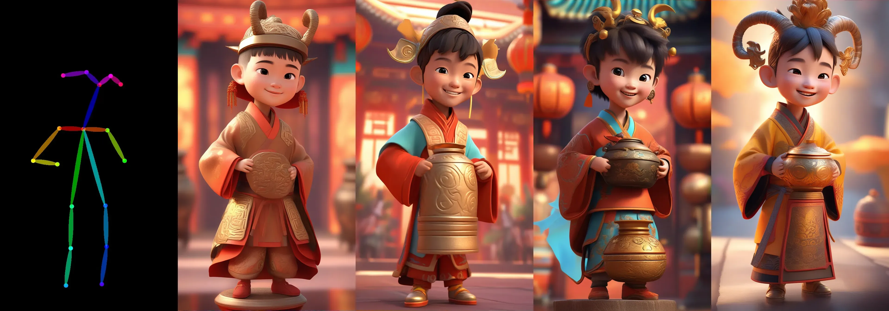

# ControlNetPlus
## ControlNet++: All-in-one ControlNet for image generations and editing!

We design a new architecture that can support 10+ control types in condition text-to-image generation and can generate high resolution images visually comparable with midjourney. The network is based on ControlNet proposed by lvmin Zhang, we propose two key modules to: 1 Extend the original ControlNet to support different image conditions using the same network parameter. 2 Support multiple conditions input, which is especially important for designers who want to edit image in detail, different conditions use the same condition encoder, without adding extra computations or parameters. We do thoroughly experiments on SDXL and achieve superior performance both in control ability and aesthetic score. We release the method and the model to the open source community to make everyone can enjoy it.

## News
- [07/06/2024] Release `ControlNet++` and pretrained models.
- [07/06/2024] Release inference code(single condition & multi condition).
  
## Dataset
We collect a large amount of high quality images. The images are filtered and annotated seriously, the images covers a wide range of subjects, including photogragh, anime, nature, midjourney and so on.

## Network Arichitecture


We propose two new module in ControlNet++, named Condition Transformer and Control Encoder, repectively. We modified an old module slightly to enhance its representation ability. Besides, we propose an unified training strategy to realize single & multi control in one stage.
### Control Encoder
For each condition, we assign it with a unique control type id, for example, openpose--(1, 0, 0, 0, 0, 0), depth--(0, 1, 0, 0, 0, 0),  multi conditions will be like (openpose, depth) --(1, 1, 0, 0, 0, 0). In the Control Encoder, the control type id will be convert to control type embeddings(using sinusoidal positional embeddings), then we use a single linear layer to proj the control type embeddings to have the same dim with time embedding. The control type features are added to the time embedding to indicate different control types, this simple setting can help the ControlNet to distinguish different control types as time embedding tends to have a global effect on the entire network. No matter single condition or multi condition, there is a unique control type id correpond to it.  
### Condition Transformer
We extend the ControlNet to support multiple control inputs at the same time using the same network. The condition transformer is used to combine different image condition features. There are two major innovations about our methods, first, different conditions shares the same condition encoder, which makes the network more simple and lightwight. this is different with other mainstream methods like T2I or UniControlNet. Second, we add a tranformer layer to exchange the info of original image and the condition images, instead of using the output of transformer directly, we use it to predict a condition bias to the original condition feature. This is somewhat like ResNet, and we experimentally found this setting can improve the performance of the network obviously.  
### Modified Condition Encoder
The original condition encoder of ControlNet is a stack of conv layer and Silu activations. We don't change the encoder architecture, we just increase the conv channels to get a "fat" encoder. This can increase the performance of the network obviously. The reason is that we share the same encoder for all image conditions, so it requires the encoder to have higher representation ability. Original setting will be well for single condition but not as good for 10+ conditions. Note that using the original setting is also OK, just with some sacrifice of image generation quality.
### Unified Training Strategy
Training with single Condition may be limited by data diversity. For example, openpose requires you to train with images with people and mlsd requires you to train with images with lines, thus may affect the performance when generating unseen objects. Besides, the difficulty of training different conditions is different, it is tricky to get all condition converge at the same time and reach the best performance of each single condition. Finally, we will tend to use two or more conditions at the same time, multi condition training will make the fusion of different conditions more smoothly and increase the robustness of the network(as single condition learn limited knowledge). We propose an unified training stage to realize the single condition optim converge and multi condition fusion at the same time.
 
## Installation
We recommend a python version >= 3.8, you can set the virtual environment using the following command:

```shell
conda create -n controlplus python=3.8
conda activate controlplus
pip install -r requirements.txt
```
## Inference Scripts

## Single Condition
### Openpose



### Depth


### Canny


### Lineart


### AnimeLineart


### Mlsd


### Scribble


### Hed


### Pidi


### Teed


### Segment


### Normal


