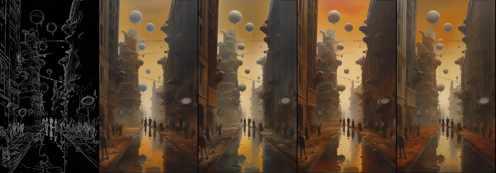

# ControlNetPlus
## ControlNet++: All-in-one ControlNet for image generations and editing!


We design a new architecture that can support 10+ control types in condition text-to-image generation and can generate high resolution images visually comparable with midjourney. The network is based on the original ControlNet architecture, we propose two new modules to: 1 Extend the original ControlNet to support different image conditions using the same network parameter. 2 Support multiple conditions input without increasing computation offload, which is especially important for designers who want to edit image in detail, different conditions use the same condition encoder, without adding extra computations or parameters. We do thoroughly experiments on SDXL and achieve superior performance both in control ability and aesthetic score. We release the method and the model to the open source community to make everyone can enjoy it.  
If you find it useful, please give me a star, Thank you very much!!


## Advantages about the model
- Use bucket training like novelai, can generate high resolutions images of any aspect ratio
- Use large amount of high quality data(over 10000000 images), the dataset covers a diversity of situation
- Use re-captioned prompt like DALLE.3, use CogVLM to generate detailed description, good prompt following ability
- Use many useful tricks during training. Including but not limited to date augmentation, mutiple loss, multi resolution
- Use almost the same parameter compared with original ControlNet. No obvious increase in network parameter or computation.
- Support 10+ control conditions, no obvious performance drop on any single condition compared with training independently
- Support multi condition generation, condition fusion is learned during training. No need to set hyperparameter or desigh prompts.


## Our other popular released model 
https://huggingface.co/xinsir/controlnet-openpose-sdxl-1.0  
https://huggingface.co/xinsir/controlnet-scribble-sdxl-1.0  
https://huggingface.co/xinsir/controlnet-tile-sdxl-1.0  
https://huggingface.co/xinsir/controlnet-canny-sdxl-1.0


## News
- [07/06/2024] Release `ControlNet++` and pretrained models.
- [07/06/2024] Release inference code(single condition & multi condition).


## Todo:
- [ ] ControlNet++ for gradio
- [ ] ControlNet++ for Comfyui
- [ ] release training code and training guidance.


## Visual Examples
### Openpose


### Depth


### Canny


### Lineart




### AnimeLineart


### Mlsd


### Scribble


### Hed


### Pidi(Softedge)


### Teed


### Segment


### Normal


  
## Dataset
We collect a large amount of high quality images. The images are filtered and annotated seriously, the images covers a wide range of subjects, including photogragh, anime, nature, midjourney and so on.

## Network Arichitecture


We propose two new module in ControlNet++, named Condition Transformer and Control Encoder, repectively. We modified an old module slightly to enhance its representation ability. Besides, we propose an unified training strategy to realize single & multi control in one stage.
### Control Encoder
For each condition, we assign it with a control type id, for example, openpose--(1, 0, 0, 0, 0, 0), depth--(0, 1, 0, 0, 0, 0),  multi conditions will be like (openpose, depth) --(1, 1, 0, 0, 0, 0). In the Control Encoder, the control type id will be convert to control type embeddings(using sinusoidal positional embeddings), then we use a single linear layer to proj the control type embeddings to have the same dim with time embedding. The control type features are added to the time embedding to indicate different control types, this simple setting can help the ControlNet to distinguish different control types as time embedding tends to have a global effect on the entire network. No matter single condition or multi condition, there is a unique control type id correpond to it.  
### Condition Transformer
We extend the ControlNet to support multiple control inputs at the same time using the same network. The condition transformer is used to combine different image condition features. There are two major innovations about our methods, first, different conditions shares the same condition encoder, which makes the network more simple and lightwight. this is different with other mainstream methods like T2I or UniControlNet. Second, we add a tranformer layer to exchange the info of original image and the condition images, instead of using the output of transformer directly, we use it to predict a condition bias to the original condition feature. This is somewhat like ResNet, and we experimentally found this setting can improve the performance of the network obviously.  
### Modified Condition Encoder
The original condition encoder of ControlNet is a stack of conv layer and Silu activations. We don't change the encoder architecture, we just increase the conv channels to get a "fat" encoder. This can increase the performance of the network obviously. The reason is that we share the same encoder for all image conditions, so it requires the encoder to have higher representation ability. Original setting will be well for single condition but not as good for 10+ conditions. Note that using the original setting is also OK, just with some sacrifice of image generation quality.
### Unified Training Strategy
Training with single Condition may be limited by data diversity. For example, openpose requires you to train with images with people and mlsd requires you to train with images with lines, thus may affect the performance when generating unseen objects. Besides, the difficulty of training different conditions is different, it is tricky to get all condition converge at the same time and reach the best performance of each single condition. Finally, we will tend to use two or more conditions at the same time, multi condition training will make the fusion of different conditions more smoothly and increase the robustness of the network(as single condition learn limited knowledge). We propose an unified training stage to realize the single condition optim converge and multi condition fusion at the same time.


## ControlMode
ControlNet++ requires to pass a control type id to the network. We merge the 10+ control to 6 control types, the meaning of each type is as follows:  
0 -- openpose  
1 -- depth  
2 -- thick line(scribble/hed/softedge/ted-512)  
3 -- thin line(canny/mlsd/lineart/animelineart/ted-1280)  
4 -- normal  
5 -- segment  


## Installation
We recommend a python version >= 3.8, you can set the virtual environment using the following command:

```shell
conda create -n controlplus python=3.8
conda activate controlplus
pip install -r requirements.txt
```
## Inference Scripts
We provide a inference scripts for each control condition. Please refer to it for more detail.

There exists some preprocess difference, to get the best openpose-control performance, please do the following:
Find the util.py in controlnet_aux package, replace the draw_bodypose function with the following code
```python
def draw_bodypose(canvas: np.ndarray, keypoints: List[Keypoint]) -> np.ndarray:
    """
    Draw keypoints and limbs representing body pose on a given canvas.

    Args:
        canvas (np.ndarray): A 3D numpy array representing the canvas (image) on which to draw the body pose.
        keypoints (List[Keypoint]): A list of Keypoint objects representing the body keypoints to be drawn.

    Returns:
        np.ndarray: A 3D numpy array representing the modified canvas with the drawn body pose.

    Note:
        The function expects the x and y coordinates of the keypoints to be normalized between 0 and 1.
    """
    H, W, C = canvas.shape

    
    if max(W, H) < 500:
        ratio = 1.0
    elif max(W, H) >= 500 and max(W, H) < 1000:
        ratio = 2.0
    elif max(W, H) >= 1000 and max(W, H) < 2000:
        ratio = 3.0
    elif max(W, H) >= 2000 and max(W, H) < 3000:
        ratio = 4.0
    elif max(W, H) >= 3000 and max(W, H) < 4000:
        ratio = 5.0
    elif max(W, H) >= 4000 and max(W, H) < 5000:
        ratio = 6.0
    else:
        ratio = 7.0

    stickwidth = 4

    limbSeq = [
        [2, 3], [2, 6], [3, 4], [4, 5], 
        [6, 7], [7, 8], [2, 9], [9, 10], 
        [10, 11], [2, 12], [12, 13], [13, 14], 
        [2, 1], [1, 15], [15, 17], [1, 16], 
        [16, 18],
    ]

    colors = [[255, 0, 0], [255, 85, 0], [255, 170, 0], [255, 255, 0], [170, 255, 0], [85, 255, 0], [0, 255, 0], \
              [0, 255, 85], [0, 255, 170], [0, 255, 255], [0, 170, 255], [0, 85, 255], [0, 0, 255], [85, 0, 255], \
              [170, 0, 255], [255, 0, 255], [255, 0, 170], [255, 0, 85]]

    for (k1_index, k2_index), color in zip(limbSeq, colors):
        keypoint1 = keypoints[k1_index - 1]
        keypoint2 = keypoints[k2_index - 1]

        if keypoint1 is None or keypoint2 is None:
            continue

        Y = np.array([keypoint1.x, keypoint2.x]) * float(W)
        X = np.array([keypoint1.y, keypoint2.y]) * float(H)
        mX = np.mean(X)
        mY = np.mean(Y)
        length = ((X[0] - X[1]) ** 2 + (Y[0] - Y[1]) ** 2) ** 0.5
        angle = math.degrees(math.atan2(X[0] - X[1], Y[0] - Y[1]))
        polygon = cv2.ellipse2Poly((int(mY), int(mX)), (int(length / 2), int(stickwidth * ratio)), int(angle), 0, 360, 1)
        cv2.fillConvexPoly(canvas, polygon, [int(float(c) * 0.6) for c in color])

    for keypoint, color in zip(keypoints, colors):
        if keypoint is None:
            continue

        x, y = keypoint.x, keypoint.y
        x = int(x * W)
        y = int(y * H)
        cv2.circle(canvas, (int(x), int(y)), int(4 * ratio), color, thickness=-1)

    return canvas
```
You should give a prompt and an control image, change the correspond lines in python file.
```shell
python controlnet_union_test_openpose.py
```

